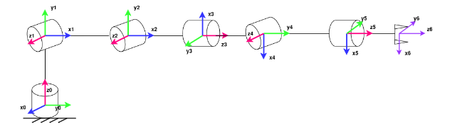

# FoR
Solutions for the Fundamentals of Robotics course. Innopolis University, spring semester 2024.

The taks cover Forward Kinematics, Inverse Kinematics, Differential Kinematics, Trajectory Planning, Inverse Dyncamics. 

All calculations are performed for an **antropomorphic manipulator** with a **spherical wrist**. 

The structure is as follows:

- `assig1` contains calculation of FK
- `assig2` contains calculation of IK, Trajectory Planning 
- `assig3` contains calculation of ID

The detailed desccription of the tasks is inside the `tasks` folder. 
